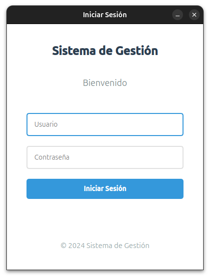
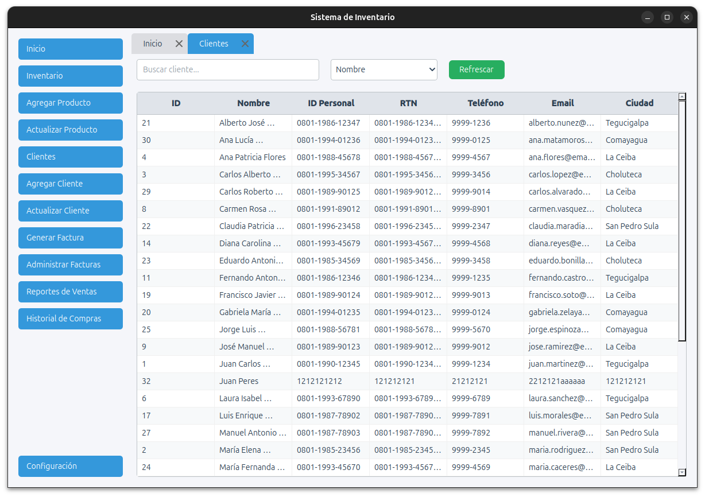

# Sistema de Gestión - Inventory Management System

A modern and user-friendly inventory management system built with PyQt6, designed to help businesses efficiently manage their inventory, customers, sales, and invoicing processes.

## Features

- **Modern User Interface**: Clean and intuitive design with a professional look
- **Secure Login System**: Protected access to business data
- **Inventory Management**: Track and manage your products
- **Add Products**: Add new products to your inventory with LPS currency support
- **Update Products**: Safely update product details (name, quantity, cost, price) with a dedicated tab
- **Sorting and Refresh**: Sort inventory and clients by any column (ASC/DESC) and refresh the view with a single click
- **Customer Management**: Maintain customer information and history
- **Add Clients**: Add new clients with validation for unique ID and RTN
- **Update Clients**: Search and update client information with a dedicated tab
- **Test Data**: The system auto-populates with 30 sample clients and 20 products for testing/demo
- **Sales Tracking**: Monitor and analyze sales data
- **Invoice Generation**: Create and manage invoices easily
- **Localized Currency**: All cost and price fields use LPS (Lempiras) for compatibility with local businesses

## Screenshots

### Login Screen


_Secure login interface with modern design_

### Main Dashboard


_Main application interface with navigation menu_

### Inventory Tab


_Inventory management with sorting, search, and LPS currency_

### Add Product Tab


_Add new products with LPS currency_

### Update Product Tab


_Update existing products safely_

### Clients Tab


_Manage clients with search, sorting, and test data_

### Add Client Tab


_Add new clients with validation_

### Update Client Tab


_Update client information easily_

## Client Management

- **Clients Tab**: View all clients in a sortable, searchable table. Sort by ID, name, RTN, city, and more (ASC/DESC).
- **Add Client Tab**: Add new clients with required fields (Name, ID Personal, City) and unique constraints (ID Personal, RTN).
- **Update Client Tab**: Search for clients by name, ID, or RTN and update their information.
- **Test Data**: On first run, the system auto-populates with 30 realistic sample clients for demonstration and testing.
- **Validation**: Prevents duplicate IDs and RTNs, and provides user feedback for errors.

## Benefits for Your Business

- **Streamlined Operations**: Manage all aspects of your business from a single application
- **Improved Efficiency**: Quick access to inventory levels and customer information
- **Better Organization**: Keep track of products, sales, and customer data in one place
- **Professional Invoicing**: Generate professional invoices for your customers
- **Data Security**: Secure login system to protect your business information
- **Localized for Honduras**: LPS currency support for accurate financial management

## Technical Details

- Built with Python and PyQt6
- Modern UI with a clean, professional design
- Responsive and user-friendly interface
- Cross-platform compatibility

## Setup Instructions

1. Clone the repository:

```bash
git clone https://github.com/EduardoMGuillen/InvenatoryManagement.git
```

2. Create and activate a virtual environment:

```bash
python -m venv venv
source venv/bin/activate  # On Linux/Mac
# or
venv\Scripts\activate  # On Windows
```

3. Install dependencies:

```bash
pip install -r requirements.txt
```

4. Run the application:

```bash
python main.py
```

## Requirements

- Python 3.8 or higher
- PyQt6
- SQLite3 (included with Python)

## Contributing

Feel free to submit issues and enhancement requests!

## License

This project is licensed under the MIT License - see the LICENSE file for details.

---

_Note: This is a work in progress. More features and improvements are coming soon!_
